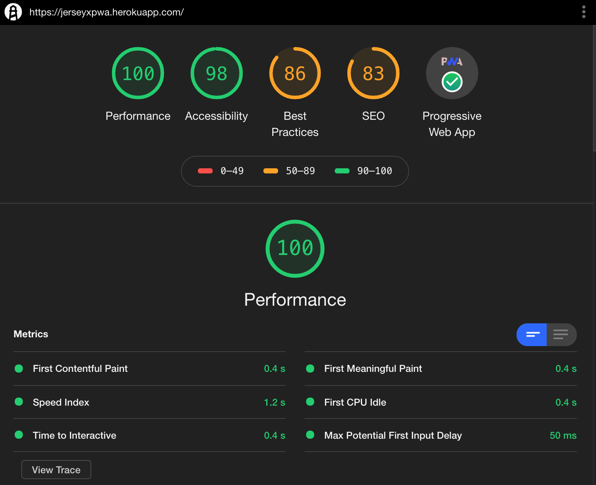
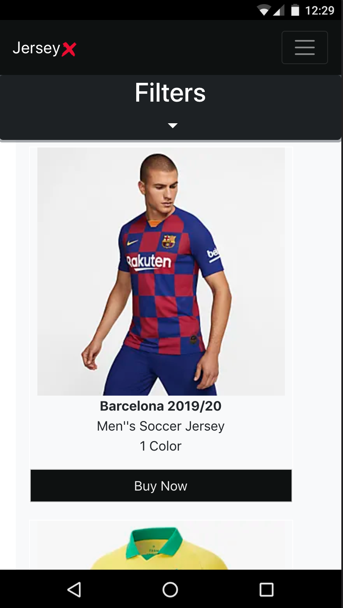

# Jersey X Progressive Web App

An Ecommerce website that serves an ExpressJS JSON api to a React client application. The React application is configured for a basic JWT authentication flow **WITHOUT** using redux. Great for those of you that are somewhat familiar with Node, Express, and Mongoose, but want to see an implementation of React + React Router with JWT authentication.

https://jerseyxpwa.herokuapp.com/

---

## Progressive Web APP Screenshots

### Audit Scores

## Audit

| Pre-Audit             |      Post-Audit       |
| --------------------- | :-------------------: |
|  |  |

### Pwa Scores

### Mobile View Home

### Mobile View Products

### Mobile Shortcut

## Requirements

For development, you will only need Node.js and a node global package, Yarn, installed in your environement.

### Node

- #### Node installation on Windows

  Just go on [official Node.js website](https://nodejs.org/) and download the installer.
  Also, be sure to have `git` available in your PATH, `npm` might need it (You can find git [here](https://git-scm.com/)).

- #### Node installation on Ubuntu

  You can install nodejs and npm easily with apt install, just run the following commands.

      $ sudo apt install nodejs
      $ sudo apt install npm

- #### Other Operating Systems
  You can find more information about the installation on the [official Node.js website](https://nodejs.org/) and the [official NPM website](https://npmjs.org/).

If the installation was successful, you should be able to run the following command.

    $ node --version
    v8.11.3

    $ npm --version
    6.1.0

If you need to update `npm`, you can make it using `npm`! Cool right? After running the following command, just open again the command line and be happy.

    $ npm install npm -g

###

### Yarn installation

After installing node, this project will need yarn too, so just run the following command.

      $ npm install -g yarn

---

## Install

    $ git clone https://github.com/RafaelBotello/jerseyxPWA
    $ cd Jerseyx-v4
    $ yarn install

## Running the project

    $ yarn start

## Simple build for production

    $ yarn build
